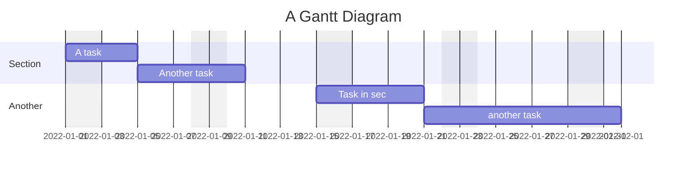

## Create a link

https://help.obsidian.md/How+to/Format+your+notes (If needed)

You create two notes and link them together using the \[[double bracket syntax]].

Interlinks a \[[Dictionary#Addition|Addition]] Displays the word Addition and clicking on it links to the header called __"Addition"__ from the Dictionary note. 

External links like \[Obsidian](http://obsidian.md) appears as [Obsidian](http://obsidian.md)

## Formatting
*Italics* can be done using  either \ * or the \ _ before the word. Remember to close it with another \ *  or \  _ .
**BOLDS** can be done using  either \ * or the \ _ before the word. Remember to close it as well.
Can be __*COMBINED*__ by using both \ __ and \  * .

###### <b><u>List</u></b>
Automatically number using the \ "-" markdown for un-numbered list and "1." for Numbered list

###### <b><u>Escape Sequence</u></b>
Escape sequence is the " \\" key before markdown. Used to ignore markdown commands such as \ * or <b>`</b> to ignore html`

###### <b><u>Blockquotes</u></b>
Create Blockquotes using the ">" markdown

>WHO AM I?
>
> \- Anon, 2022

Add info call out using " >[!INFO] " and adding " > " for every subsequent line

>[!INFO]
>yea boi
>IM HERE TO STAY

###### <b><u>To Do List</u></b>
- [x] This is done
- [ ] This is undone

#### Html formats

###### <b><u>Colouring Text</u></b>
Colouring text with "\your text""
Highlight using " == == " ==yea boiiiiii==

###### <b><u>Fonts and stuff</u></b>
`fun stuff

###### <b><u>Super and subscripts  </u></b>
\ asdasdasd   
\ asdasdasd "

###### <b><u>Emphasis</u></b>
simple emphasis using one pair of " ` " " ` " in between your words. (It's the button beside the 1 key)
I `live` in `sembawang` with my `KATHY!`

Add footnote links using  _ " \[^1] " **IGNORE SPACES** and remember to add the reference for it too. by using
" [ ^ 1 ] : " (DO note can only be in effect during read mode!)

## Tables 
Tables can be created by using
'|First Header | Second Header|
|------------ | -----‐------|
|Content from cell 1 | Content from cell 2|
|Content in the first column | Content in the second column|'

Justify table using " :---" left align, "---:" right align, ":---:" centre align.

or use https://www.tablesgenerator.com/markdown_tables#

## Graphs and Charts
Obsidian uses [Mermaid](https://mermaid-js.github.io/) to render diagrams and charts. Mermaid also provides [a helpful live editor](https://mermaid-js.github.io/mermaid-live-editor).  
Mermaid provides the following diagram types:

-   Flowchart
-   Sequence diagram
-   Class Diagram
-   State Diagram
-   Entity Relationship Diagram
-   User Journey
-   Gantt
-   Pie Chart
-   Requirement Diagram

[^1]: ME!1